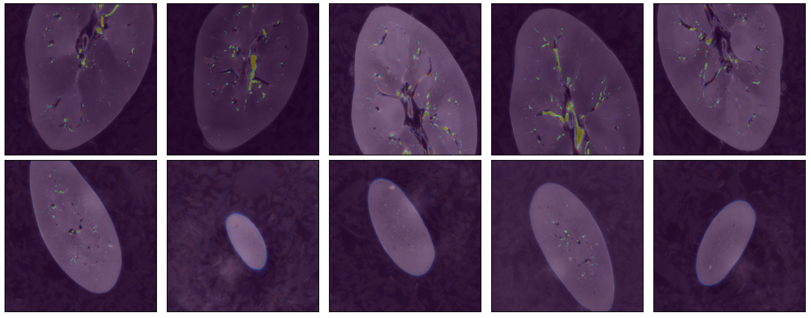

# 3D Vasculature Segmentation with TransUNet 2.5D

## Overview

This repository contains my submission for the SenNet + HOA competition on segmenting blood vessels in 3D scans of human kidneys using the TransUNet 2.5D model. The competition aims to advance our understanding of human vasculature through machine learning and contribute to the development of the Vasculature Common Coordinate Framework (VCCF).

## Dataset

The dataset provided by the competition consists of high-resolution 3D Hierarchical Phase-Contrast Tomography (HiP-CT) images of human kidneys. It includes both training and test sets with segmentation masks for blood vessels in TIFF format.

## Model

I have utilized the TransUNet 2.5D model for this project. TransUNet combines the Transformer architecture with the U-Net model, specifically designed for medical image segmentation tasks. The 2.5D approach incorporates slices from adjacent images, enriching the model's understanding of 3D structures through depth information.

## References

- **TransUNet**: [Chen et al., "TransUNet: Transformers Make Strong Encoders for Medical Image Segmentation", arXiv:2102.04306](https://arxiv.org/abs/2102.04306).
- **HiP-CT Imaging Technique**: For more information on the HiP-CT imaging technique, refer to the Nature Methods article mentioned in the competition details.
- **SenNet + HOA Competition Details**: For detailed competition rules, dataset descriptions, and submission guidelines, visit the official competition page.

